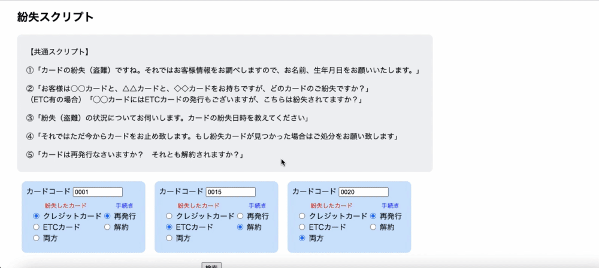
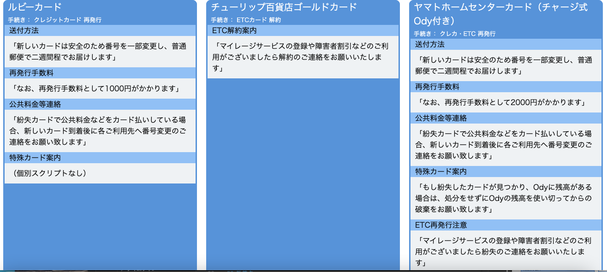

# README

## アプリケーション名
talk_script

## アプリケーション概要
クレジットカード会社の紛失係コールセンター用業務アプリ。
当アプリとは別に顧客検索端末があるものとし、名前・生年月日等から顧客の所持しているカード（カードコード）を特定。
当アプリにカードコードの入力、紛失したカードの種類（クレカ・ETC）と手続きを選択することで、顧客への案内文（トークスクリプト）が表示される仕組みとなっています。

## URL
https://talk-script.onrender.com/

## テスト用アカウント
- Basic認証ID：admin
- Basic認証パスワード：2222

## 利用方法
- 「紛失・盗難」か「不正利用」を選択する。
- 「カードコード」に0001〜0020の番号を入力する。
（予めDBにはカードコード、カード名称、再発行時の案内などが登録されている）
- 「紛失したカード（停止するカード）」からラジオボタンを選択する。
- 「手続き」からラジオボタンを選択する。
- 確定ボタンを押すと、カードコードに応じたトークスクリプトが表示される。

## アプリケーションを作成した背景
勤務先（クレジットカード会社の紛失係）での問題解決のために作成しました。  
現在、基本的なトークスクリプトやカードの種類毎の特殊スクリプト、送付方法、手数料一覧などの資料は用意されていますが、それぞれの資料が独立していて相互アクセスしづらく案内漏れや間違いが多発し、電話オペレーターの負担となっています。また、難易度の高さゆえ新人が定着しづらく、採用・研修に関わるコストや人的リソースの部分で常に疲弊している状況です。
このアプリを実装することで業務の難易度を下げ、人員の定着を図りたいと考えています。  

## 洗い出した要件
https://docs.google.com/spreadsheets/d/1Q_g8oMrWcd2Ip5evtlk2rIAOXthG_uMxuA4Nr4-09ic/edit#gid=982722306

## 実装した機能についての画像やGIFおよびその説明

## データベース設計

## 画面遷移図

## 開発環境
Ruby / Ruby on Rails / MySQL / PostgreSQL / GitHub / Render / Visual Studio Code

## 工夫したポイント
一度に3種類のトークスクリプトを表示させられるようにしたところです。
現在の勤務先では取り扱いカードが200枚を超えており、財布ごと紛失した場合は複数枚の停止受付をすることも少なくありません。
経験則より3枚程度の手続き案内が一度に表示できれば概ね事足り、かつモニター上でも見やすく表現できたと思っています。

## 改善点
実際の業務で使用するとしたら、以下の点を改善したいです。
- ETCカードはクレカ1枚に対して複数枚発行できるため、「紛失したカード」に枚数の入力欄を設ける必要がある（再発行手数料の表示に関わるため）。

## 制作時間
50時間

